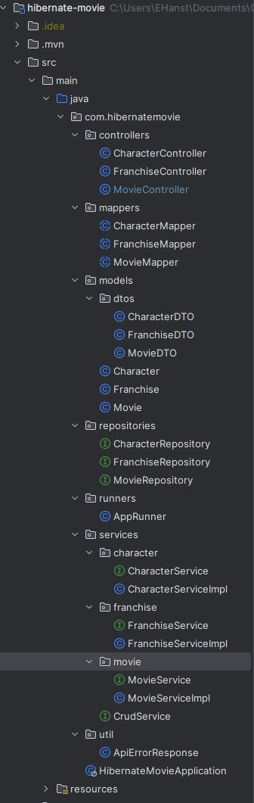

# Movie Characters API
A spring boot project using hibernate and built with maven.

## Dependencies
- openjdk19-alpine
- spring-boot-starter-data-jpa
- spring-boot-starter-web
- postgresql
- lombok
- spring-boot-starter-test
- springdoc-openapi-starter-webmvc-ui
- mapstruct

## Features
The application implements a postgres database and can through controllers and services make different calls to get, update, add and delete characters, franchises and movies. Swagger OpenAPI makes it simple to test the different calls as a user.

## File structure

### Desription
Third Assignemt Java Fullstack Remote Nordics Jan 23

### Authors
Erik Hanstad
Miwa Guhres
